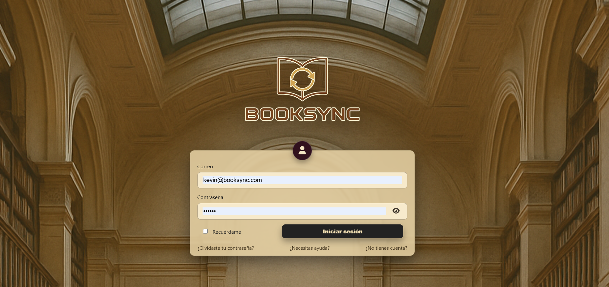
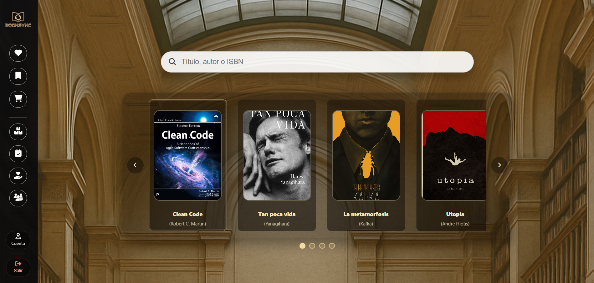
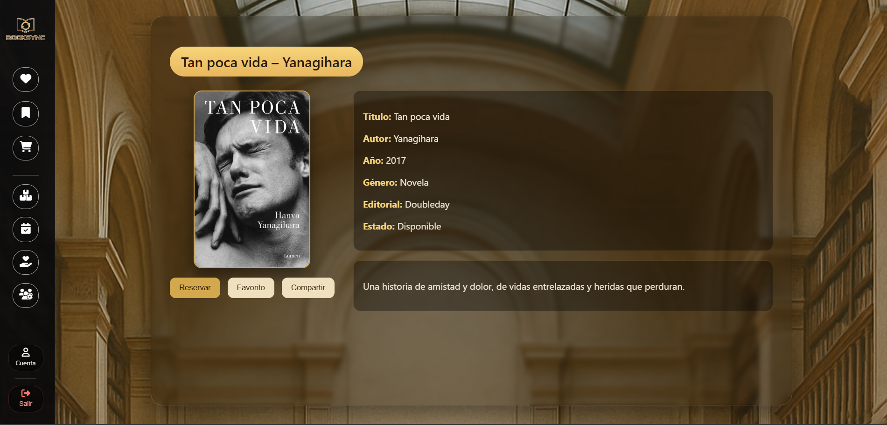
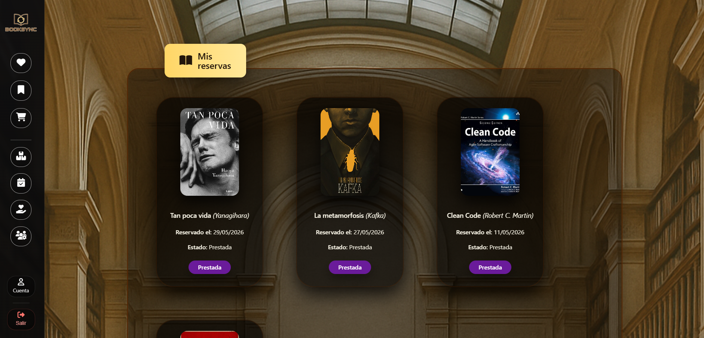
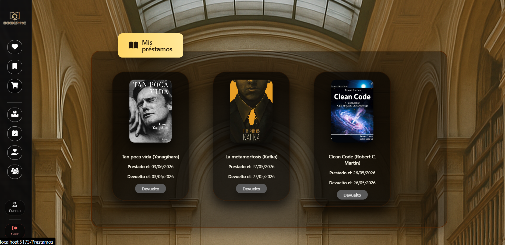
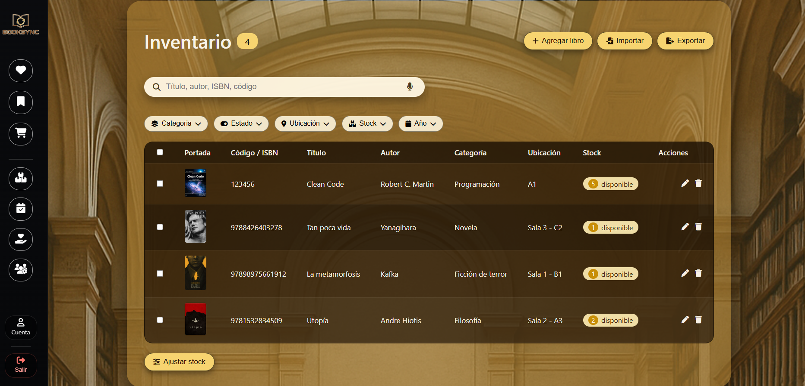

# 📚 BookSync — Sistema de Gestión Bibliotecaria

BookSync es una aplicación web fullstack para la gestión operativa de una biblioteca. Permite a usuarios buscar libros, hacer reservas y consultar préstamos, mientras que los administradores gestionan el inventario, confirman reservas y controlan el ciclo completo de préstamo y devolución.

---

## 🖼️ Vista previa

> Guardá tus capturas en una carpeta `/screenshots` en la raíz del proyecto y reemplazá los paths de abajo.

| Login | Inicio | Detalle del libro |
|-------|--------|-------------------|
|  |  |  |

| Mis reservas | Mis préstamos | Panel admin |
|--------------|---------------|-------------|
|  |  |  |

---

## 🛠️ Stack tecnológico

**Frontend**
- React 19 + Vite
- React Router DOM v7
- Axios con interceptor JWT (logout automático en 401)
- CSS puro modular
- SweetAlert2 · FontAwesome

**Backend**
- Node.js + Express 5
- MySQL2 con pool de conexiones (sin ORM)
- JWT (jsonwebtoken) + bcryptjs
- dotenv · cors · nodemon

---

## ✨ Funcionalidades

### Usuario
- Registro e inicio de sesión con JWT
- Catálogo de libros con búsqueda y filtros por género
- Detalle del libro con portada y disponibilidad en tiempo real
- Reservar libro · cancelar reserva
- Estados de reserva: activa, confirmada, cancelada, expirada, prestada
- Lista de préstamos activos e historial de devoluciones
- Lista de favoritos con opción de reservar directamente
- Gestión de cuenta: editar perfil, cambiar contraseña, desactivar cuenta

### Administrador
- Inventario de libros: crear, editar, eliminar con subida de portada
- Gestión de reservas: confirmar o rechazar con devolución automática de stock
- Gestión de préstamos: registrar préstamo desde reserva confirmada, registrar devolución
- Gestión de usuarios: cambiar rol, activar/desactivar
- Filtros por estado, usuario y fecha en todos los paneles admin

### Seguridad
- Rutas protegidas con `PrivateRoute` (usuario) y `AdminRoute` (admin) en el frontend
- Middleware de autenticación JWT y verificación de rol en el backend
- Logout automático al expirar el token (interceptor axios)
- Expiración automática de reservas no confirmadas

---

## 📁 Estructura del proyecto

```
BOOKSYNC/
├── Client/                      # Frontend React + Vite
│   └── src/
│       ├── components/          # Sidebar, AdminRoute, PrivateRoute
│       ├── context/             # AuthContext (JWT, login, logout)
│       ├── hooks/               # useToast, useLogoutToast
│       ├── pages/
│       │   ├── auth/            # Login, Register, Help, ForgotPassword, ResetPassword
│       │   ├── dashboard/       # Home, Detalle, Reservas, Préstamos, Favoritos, Cuenta
│       │   └── Admin/           # InventarioAdmin, ReservasAdmin, PrestamosAdmin, UsuariosAdmin
│       ├── services/            # Funciones axios por módulo
│       └── styles/              # CSS modular por vista
│
└── Server/                      # Backend Node.js + Express
    └── src/
        ├── controllers/         # Lógica de negocio por módulo
        ├── models/              # Queries SQL con mysql2 (sin ORM)
        ├── routes/              # Endpoints REST por módulo
        └── middlewares/         # auth.middleware, role.middleware
```

---

## 🚀 Instalación y ejecución

### Requisitos previos
- Node.js 18+
- MySQL 8+

### 1. Clonar el repositorio

```bash
git clone https://github.com/tu-usuario/booksync.git
cd booksync
```

### 2. Configurar el backend

```bash
cd Server
npm install
```

Creá un archivo `.env` en `/Server`:

```env
PORT=3000
DB_HOST=localhost
DB_USER=root
DB_PASSWORD=tu_password
DB_NAME=booksync
JWT_SECRET=tu_clave_secreta
```

Importá el esquema de base de datos:

```bash
mysql -u root -p booksync < booksync.sql
```

Iniciá el servidor:

```bash
npm run dev
# http://localhost:3000
```

### 3. Configurar el frontend

```bash
cd ../Client
npm install
npm run dev
# http://localhost:5173
```

---

## 🔌 API — Endpoints principales

### Auth
| Método | Ruta | Descripción |
|--------|------|-------------|
| POST | `/auth/login` | Iniciar sesión |
| POST | `/auth/register` | Registrar usuario |

### Usuarios
| Método | Ruta | Acceso |
|--------|------|--------|
| GET | `/users/profile` | Autenticado |
| PUT | `/users/profile` | Autenticado |
| PATCH | `/users/profile/password` | Autenticado |
| DELETE | `/users/profile` | Autenticado |
| GET | `/users` | Admin |
| PATCH | `/users/:id/role` | Admin |
| PATCH | `/users/:id/status` | Admin |

### Libros
| Método | Ruta | Acceso |
|--------|------|--------|
| GET | `/libros` | Público |
| GET | `/libros/:id` | Público |
| POST | `/libros` | Admin |
| PUT | `/libros/:id` | Admin |
| DELETE | `/libros/:id` | Admin |

### Reservas
| Método | Ruta | Acceso |
|--------|------|--------|
| POST | `/reservas` | Usuario |
| GET | `/reservas/mis` | Usuario |
| PATCH | `/reservas/:id/cancelar` | Usuario |
| GET | `/admin/reservas` | Admin |
| PATCH | `/admin/reservas/:id/confirmar` | Admin |
| PATCH | `/admin/reservas/:id/cancelar` | Admin |

### Préstamos
| Método | Ruta | Acceso |
|--------|------|--------|
| POST | `/prestamos` | Admin |
| GET | `/prestamos/mis` | Usuario |
| GET | `/admin/prestamos` | Admin |
| PATCH | `/prestamos/:id/devolver` | Admin |

---

## 👤 Autor

**Kevin Esteven**
- Email: kevinesteven0627@gmail.com
- Tel: 3124046821

---

## 📌 Estado del proyecto

MVP completado. Funcionalidades previstas para versiones futuras:
- Recuperación de contraseña por email (Nodemailer)
- Módulo de notificaciones y alertas
- Exportación / importación de inventario en CSV o Excel
- Acciones masivas sobre libros seleccionados
