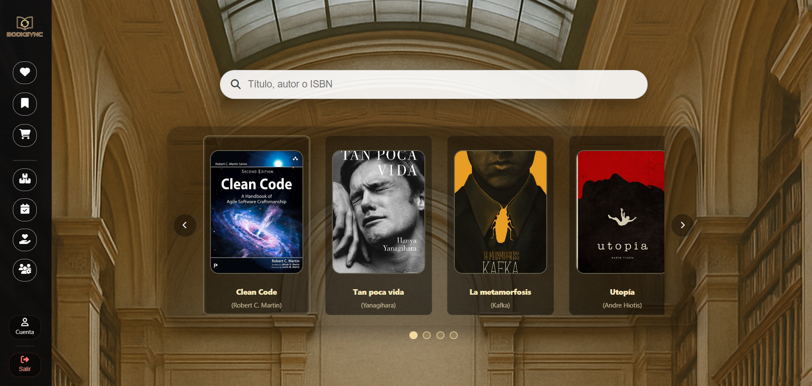
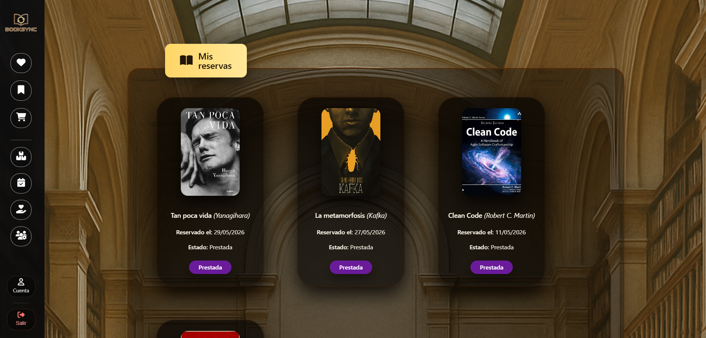
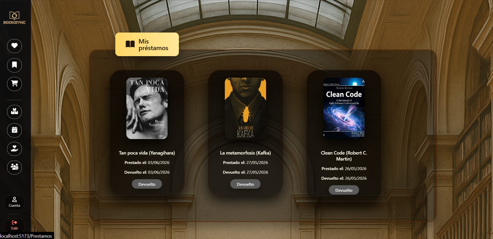
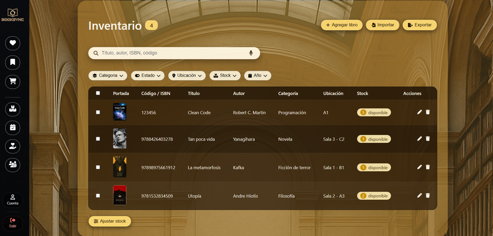

# 📚 BookSync — Sistema de Gestión Bibliotecaria

BookSync es una aplicación web fullstack para la gestión operativa de una biblioteca. Permite a usuarios buscar libros, hacer reservas y consultar préstamos, mientras que los administradores gestionan el inventario, confirman reservas y controlan el ciclo completo de préstamo y devolución.

---

## 🖼️ Vista previa

| Login                           | Inicio                        | Detalle del libro                   |
| ------------------------------- | ----------------------------- | ----------------------------------- |
|  |  |  |

| Mis reservas                          | Mis préstamos                           | Panel admin                     |
| ------------------------------------- | --------------------------------------- | ------------------------------- |
|  |  |  |

---

## 🛠️ Stack tecnológico

**Frontend**

- React 19 + Vite
- React Router DOM v7
- Axios con interceptor JWT (logout automático en 401)
- CSS puro modular
- SweetAlert2 · FontAwesome

**Backend**

- Node.js + Express 5
- MySQL2 con pool de conexiones (sin ORM)
- JWT (jsonwebtoken) + bcryptjs
- dotenv · cors · nodemon

---

## ✨ Funcionalidades

### Usuario

- Registro e inicio de sesión con JWT
- Catálogo de libros con búsqueda y filtros por género
- Detalle del libro con portada y disponibilidad en tiempo real
- Reservar libro · cancelar reserva
- Estados de reserva: activa, confirmada, cancelada, expirada, prestada
- Lista de préstamos activos e historial de devoluciones
- Lista de favoritos con opción de reservar directamente
- Gestión de cuenta: editar perfil, cambiar contraseña, desactivar cuenta

### Administrador y bibliotecario

BookSync distingue dos niveles de acceso además de usuario: **administrador** (gestión completa) y **bibliotecario** (operación diaria). Ambos comparten reservas y préstamos; inventario y usuarios son exclusivos de administrador.

- Inventario de libros: crear, editar, eliminar con subida de portada, importar por CSV, acciones masivas (ajustar stock, eliminar seleccionados) — **solo administrador**
- Gestión de reservas: confirmar o rechazar con devolución automática de stock — administrador y bibliotecario
- Gestión de préstamos: registrar préstamo desde reserva confirmada, registrar devolución — administrador y bibliotecario
- Gestión de usuarios: cambiar rol, activar/desactivar (con protección para no quedar sin administrador activo) — **solo administrador**
- Filtros por estado, usuario y fecha en todos los paneles admin

### Seguridad

- Rutas protegidas con `PrivateRoute` (usuario) y `AdminRoute` (admin) en el frontend
- Middleware de autenticación JWT y verificación de rol en el backend (`isAdmin` / `isStaff`)
- Logout automático al expirar el token (interceptor axios)
- Expiración automática de reservas no confirmadas
- Recuperación de contraseña por correo con token de un solo uso (Nodemailer)

---

## 📁 Estructura del proyecto

```
BOOKSYNC/
├── Client/                      # Frontend React + Vite
│   └── src/
│       ├── components/          # Sidebar, AdminRoute, PrivateRoute
│       ├── context/             # AuthContext (JWT, login, logout)
│       ├── hooks/               # useToast, useLogoutToast
│       ├── pages/
│       │   ├── auth/            # Login, Register, Help, ForgotPassword, ResetPassword
│       │   ├── dashboard/       # Home, Detalle, Reservas, Préstamos, Favoritos, Cuenta
│       │   └── Admin/           # InventarioAdmin, ReservasAdmin, PrestamosAdmin, UsuariosAdmin
│       ├── services/            # Funciones axios por módulo
│       └── styles/              # CSS modular por vista
│
└── Server/                      # Backend Node.js + Express
    └── src/
        ├── controllers/         # Lógica de negocio por módulo
        ├── models/              # Queries SQL con mysql2 (sin ORM)
        ├── routes/              # Endpoints REST por módulo
        └── middlewares/         # auth.middleware, role.middleware
```

---

## 🚀 Instalación y ejecución

### Requisitos previos

- Node.js 18+
- MySQL 8+

### 1. Clonar el repositorio

```bash
git clone https://github.com/tu-usuario/booksync.git
cd booksync
```

### 2. Configurar el backend

```bash
cd Server
npm install
```

Creá un archivo `.env` en `/Server` usando `Server/.env.example` como referencia. Las variables `PORT`, `DB_*` y `JWT_*` son obligatorias para que el backend arranque; `EMAIL_*`, `FRONTEND_URL` y `R2_*` son opcionales y solo afectan la recuperación de contraseña por correo y la subida de portadas — sin ellas, el resto de la app funciona con normalidad.

Importá el esquema de base de datos:

```bash
mysql -u root -p booksync < bd_booksync_final.sql
```

Iniciá el servidor:

```bash
npm run dev
# http://localhost:3000
```

### 3. Configurar el frontend

```bash
cd ../Client
npm install
npm run dev
# http://localhost:5173
```

---

## 🔌 API — Endpoints principales

Todas las rutas cuelgan del prefijo `/api`.

### Auth (`/api/auth`)

| Método | Ruta                       | Acceso  | Descripción                              |
| ------ | -------------------------- | ------- | ----------------------------------------- |
| POST   | `/register`                | Pública | Registrar usuario                          |
| POST   | `/login`                   | Pública | Iniciar sesión                             |
| POST   | `/forgot-password`         | Pública | Solicitar recuperación de contraseña       |
| POST   | `/reset-password/:token`   | Pública | Cambiar contraseña con el token del correo |

### Usuarios (`/api/users`)

| Método | Ruta                      | Acceso      | Descripción                  |
| ------ | ------------------------- | ----------- | ----------------------------- |
| GET    | `/profile`                | Autenticado | Ver mi perfil                 |
| PUT    | `/profile`                | Autenticado | Actualizar mis datos          |
| PATCH  | `/profile/password`       | Autenticado | Cambiar mi contraseña         |
| DELETE | `/profile`                | Autenticado | Desactivar mi cuenta          |
| GET    | `/`                       | Admin       | Listar todos los usuarios     |
| PATCH  | `/:id/role`                | Admin       | Cambiar rol de un usuario     |
| PATCH  | `/:id/status`               | Admin       | Activar/desactivar un usuario |

### Libros (`/api/libros`)

| Método | Ruta            | Acceso      | Descripción                          |
| ------ | --------------- | ----------- | -------------------------------------- |
| GET    | `/`             | Autenticado | Listar libros (con filtros)            |
| GET    | `/genres`       | Autenticado | Géneros distintos                      |
| GET    | `/recomendados` | Autenticado | Libros más prestados (carrusel Home)   |
| GET    | `/:id`          | Autenticado | Detalle de un libro                    |
| POST   | `/`             | Admin       | Crear libro                            |
| POST   | `/import`       | Admin       | Importar libros desde CSV              |
| POST   | `/upload-cover` | Admin       | Subir portada a Cloudflare R2          |
| PUT    | `/:id`          | Admin       | Actualizar libro                       |
| DELETE | `/:id`          | Admin       | Eliminar libro (soft delete)           |

### Favoritos (`/api/favorite`)

| Método | Ruta        | Acceso      | Descripción                          |
| ------ | ----------- | ----------- | -------------------------------------- |
| GET    | `/`         | Autenticado | Mis favoritos                          |
| GET    | `/ids`      | Autenticado | IDs de mis favoritos                   |
| GET    | `/:idLibro` | Autenticado | Verificar si un libro es favorito      |
| POST   | `/:idLibro` | Autenticado | Agregar a favoritos                    |
| DELETE | `/:idLibro` | Autenticado | Quitar de favoritos                    |

### Reservas (`/api/reservas`)

| Método | Ruta                              | Acceso                    | Descripción                        |
| ------ | ---------------------------------- | -------------------------- | ------------------------------------ |
| GET    | `/mis`                              | Autenticado                 | Mis reservas                         |
| POST   | `/:idLibro`                         | Autenticado                 | Crear reserva                        |
| DELETE | `/:idReserva`                       | Autenticado                 | Cancelar mi reserva                  |
| GET    | `/admin`                            | Admin / bibliotecario       | Listar todas las reservas            |
| POST   | `/admin`                            | Admin / bibliotecario       | Crear reserva a nombre de un usuario |
| PATCH  | `/admin/:idReserva/confirmar`       | Admin / bibliotecario       | Confirmar reserva                    |
| PATCH  | `/admin/:idReserva/cancelar`        | Admin / bibliotecario       | Cancelar reserva                     |

### Préstamos (`/api/prestamos`)

| Método | Ruta                     | Acceso                | Descripción                          |
| ------ | ------------------------ | ---------------------- | -------------------------------------- |
| GET    | `/MisPrestamos`           | Autenticado             | Mis préstamos                          |
| POST   | `/reserva/:idReserva`     | Admin / bibliotecario   | Registrar préstamo desde una reserva   |
| PATCH  | `/devolver/:idPrestamo`   | Admin / bibliotecario   | Registrar devolución                   |
| GET    | `/list`                   | Admin / bibliotecario   | Listar todos los préstamos             |

---

## 👤 Autor

**Kevin Steven**

- Email: kevinesteven0627@gmail.com
- Tel: 3124046821

---

## 📌 Estado del proyecto

Proyecto completado como trabajo de grado (SENA — Tecnólogo en Análisis y Desarrollo de Software). Funcionalidades previstas para versiones futuras:

- Módulo de notificaciones y alertas para el usuario
- Reportes exportables (la tabla `reporte` ya existe en el esquema, pendiente de implementar en backend/frontend)
